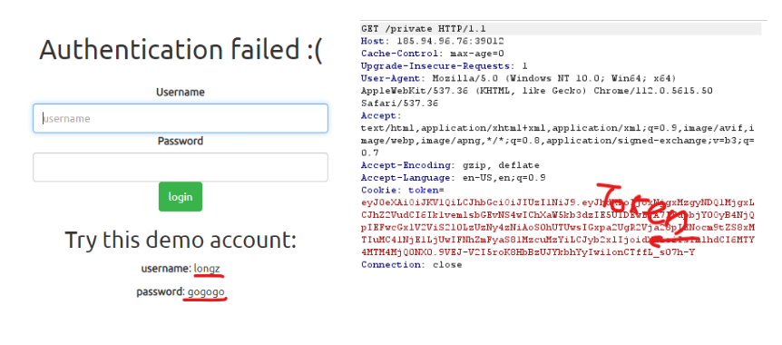
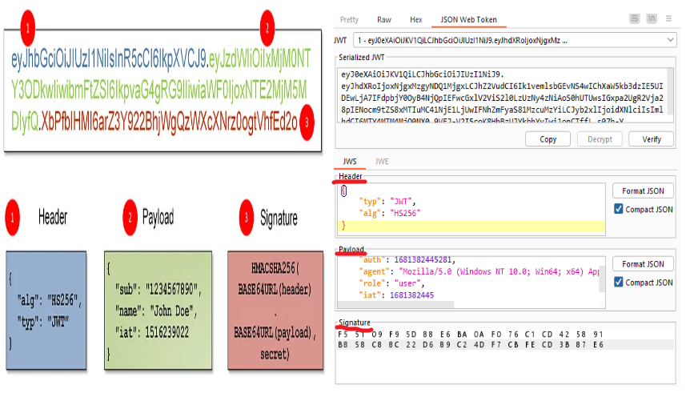
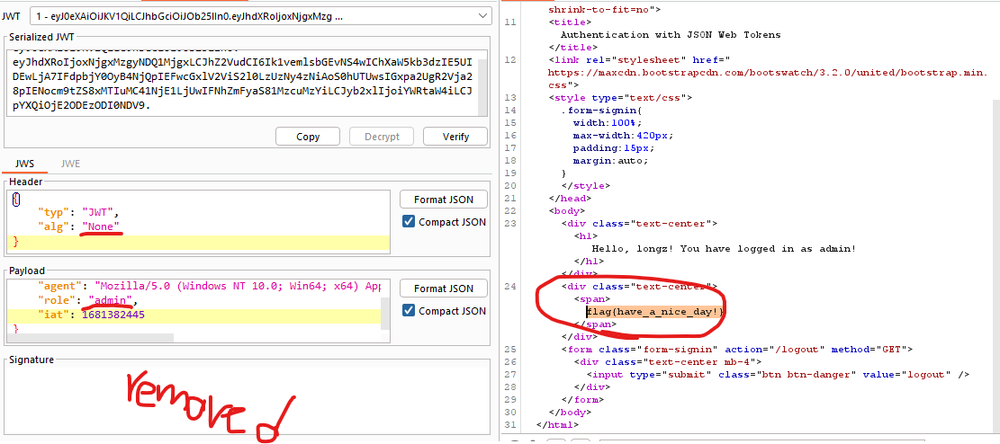

# Bad Token
Open Burp Suite! When we try to login with the default username and password and see the token, we suspect that this challenge has a JWT vulnerability.

To use this token, we need to translate and change this token to log in as an admin or something else. We can use the **'JWT Editor'** extension in Burp for this.

Well, now it's time to manipulate this token. I used this **[article](https://book.hacktricks.xyz/pentesting-web/hacking-jwt-json-web-tokens#modify-the-algorithm-to-none-cve-2015-9235)** !
After testing several methods, I came to this method! Let's change the algorithm of the token and remove its signatures, which are to secure it.

But this is not enough, we must try to enter with a user with more access, for example **'admin'**! 

It was solved that easily ! ***enjoy :)***
