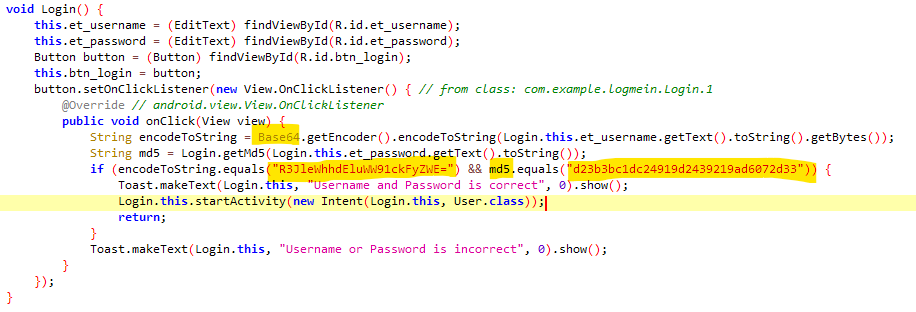

# Crack Me
This is also simple! Open jadx gui or any other decompiler and give it the CrackMe.apk file as input.

This time the format of the flag is different (queraCTF{username_password}) and we have to complete it by finding the username and password! Let's look for such things.

In this picture, it looks like we are using a function that checks the user's password and returns an answer. What does it check the user's input with?

The work is almost done, we have everything, we just have to decrypt it! Username with **base64** and password with **md5 hash**.

- This **[site](https://gchq.github.io/CyberChef/#recipe=From_Base64('A-Za-z0-9%2B/%3D',true,false))** helps to decode base64.
- This **[site](https://crackstation.net/)** helps to decode md5 hash.

Solved :)))

flag is: queraCTF{GreyhatInYourArea_monkeyfish}