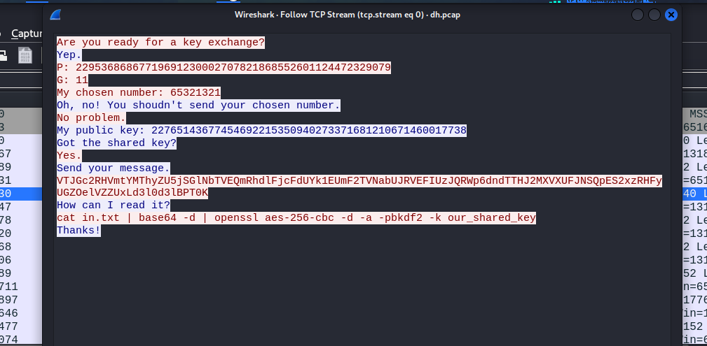
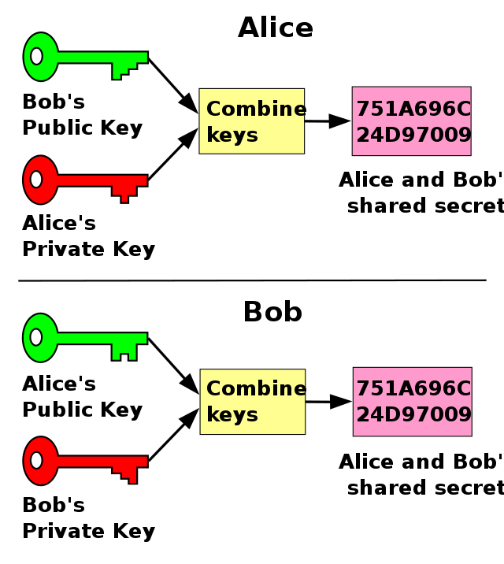
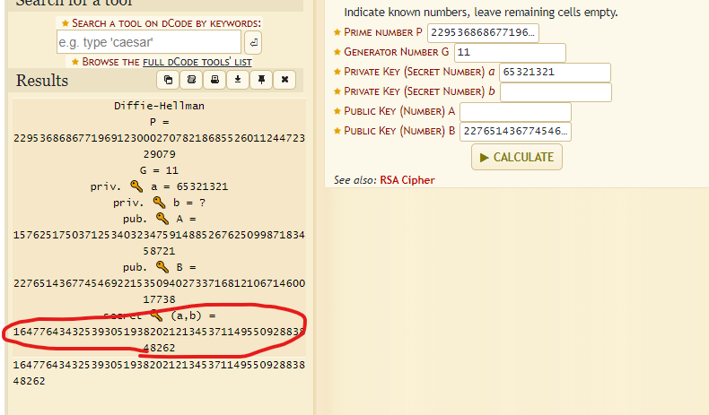
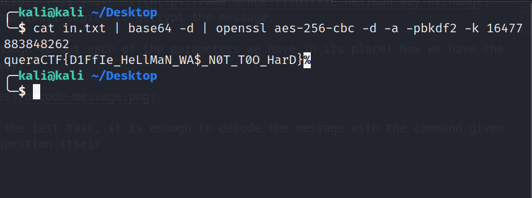

# DH Talk
It was interesting! We have a pcap file. Let's examine this file with **WireShark**.

We can use this method to see large data in Wireshark: Right click > Follow > TCP Stream

If we search about DH in the network, we will find out that it is a cryptographic method for key exchange called: **Diffe-Hellman**.

This algorithm has several parameters:
- prime number (p)
- generator number (g)
- private keys of a & b
- public keys of a & b

We must try to decrypt the encrypted message by obtaining the shared key.
we found some of these parameters, can we do something with them?

I came across this [decoder](https://www.dcode.fr/diffie-hellman-key-exchange) after some small search to decrypt the message.

It is enough to put each of the parameters we have in its place! Now we have the shared key!

And for the last task, it is enough to decode the message with the command given by the question itself:

Solved :)))

flag is: queraCTF{D1FfIe_HeLlMaN_WA$_N0T_T0O_HarD}