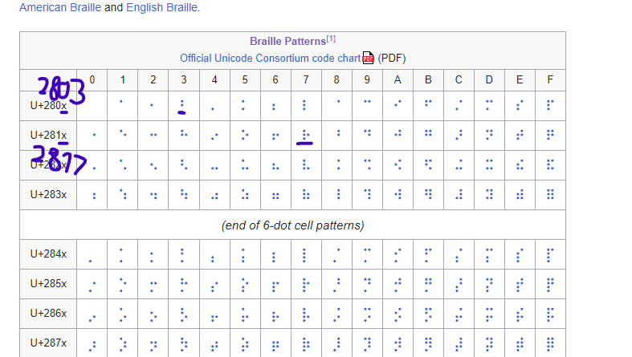

# Peaky Blinders
The format of the flag content is **"28xx"**, which seems to be a form of Unicode. Let's take a look at the Unicode table:



This is **Braille**! To translate it, you can do it manually or from \u in Python for translation.

```python
print("queraCTF{\u2803\u2817\u2801\u280A\u2807\u2807\u2811_\u280A\u280E_\u281B\u2817\u2811\u2801\u281E}")
```
Result of this code is: ``` queraCTF{⠃⠗⠁⠊⠇⠇⠑_⠊⠎_⠛⠗⠑⠁⠞} ```

For decode braille you can use [CyberChef](https://gchq.github.io/CyberChef/#recipe=From_Braille()) or [dcode](https://www.dcode.fr/braille-alphabet).

Flag is: queractf{braille_is_great}