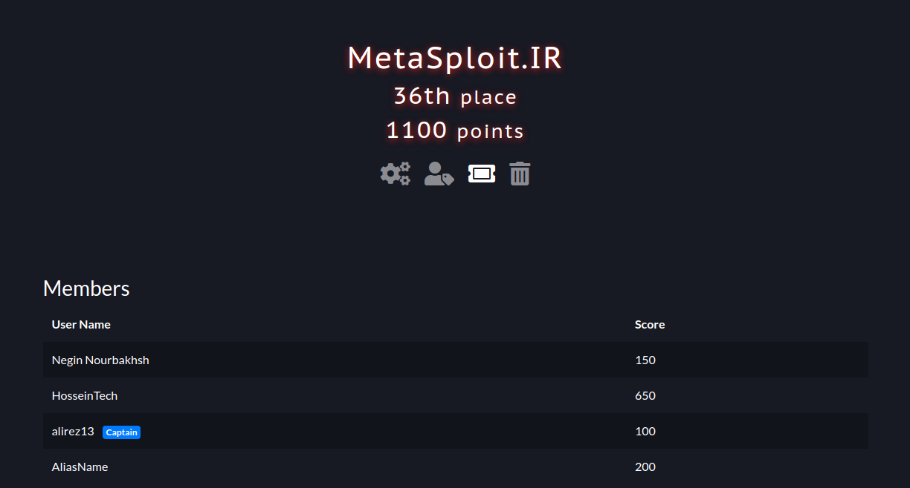

# Hackathon CTF Challenge 2023
This challenge was my first official experience in ctf and the field of security. Although I did not expect to get an interesting rank, but with the strong team we had, we got a relatively good rank.
Of course, the level of questions was a little difficult for the first experience, but we solved most of the questions.

In this repo, we decided to present our own team's write-ups about these issues :D

# Solutions
## [Challenge 1: Bad Token](https://github.com/HoseiinTech/queractf-2023/tree/main/BadToken)

## [Challenge 2: Customer Care](https://github.com/HoseiinTech/queractf-2023/tree/main/CustomerCare)

## [Challenge 3: app-fault-1](https://github.com/HoseiinTech/queractf-2023/tree/main/app-fault-1)

## [Challenge 4: app-fault-2](https://github.com/HoseiinTech/queractf-2023/tree/main/app-fault-2)

## [Challenge 5: DH Talk](https://github.com/HoseiinTech/queractf-2023/tree/main/DH-Talk)

## [Challenge 6: CrackMe](https://github.com/HoseiinTech/queractf-2023/tree/main/CrackMe)