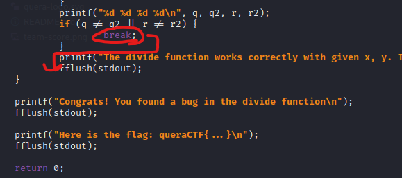
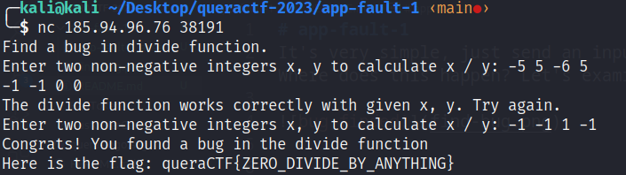

# app-fault-1
It's very simple, just send an input to break the loop and display the flag! Where does this happen? Let's examine the code.

It is enough to do something so that **q and q2** or **r and r2** are not equal to receive the flag. Let's make an unexpected entry:

***Solved (:*** It was very simple, wasn't it?

flag is: queraCTF{ZERO_DIVIDE_BY_ANYTHING}
