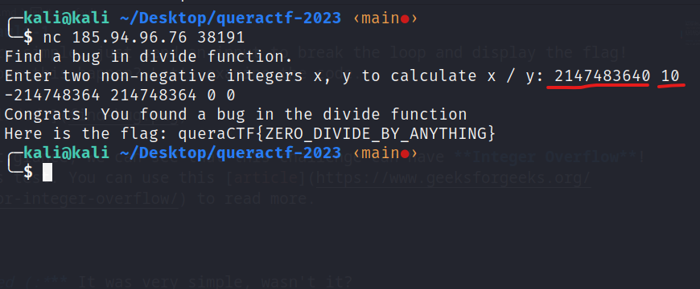

# app-fault-1
It's very simple, just send an input to break the loop and display the flag! Where does this happen? Let's examine the code.

At first glance, we can see that this challenge can have **Integer Overflow**! So let's test. You can use this [article](https://www.geeksforgeeks.org/check-for-integer-overflow/) to read more.

***Solved (:*** It was very simple, wasn't it?

flag is: queraCTF{ZERO_DIVIDE_BY_ANYTHING}
