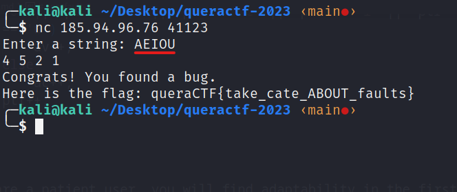

# app-fault-2
This is also very simple! We just need to send him the input that he doesn't expect :D

What does this program do? Counts and returns the **number of vowels**. This is a function of this program:

```C
void count_vowels_and_consonants(char *str)
{
    char *ptr = str;
    av = ac = 0;
    while (*ptr != '\0') {
        if (*ptr == 'A' || *ptr == 'E' || ptr == 'I' || *ptr == 'O' || *ptr == 'U' || *ptr == 'a' || *ptr == 'e' || *ptr == 'i' || *ptr == 'o' || *ptr == 'u')
            av++;
        else
            ac++;
        ptr++;
    }
}
```

If you are a patient user, you will find adaptability in the first few tries ;) which becomes:



It was solved that easily!

flag is: queraCTF{take_cate_ABOUT_faults}